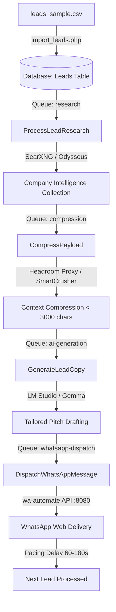

# AI Cold Message Agent (WhatsApp Outreach Pipeline)

An automated, intelligent B2B cold outreach system built with Laravel 11, Node.js (`@open-wa/wa-automate`), SearXNG, and local LLMs (Gemma via LM Studio). It researches companies, compresses data payloads, drafts personalized pitches, and sends them via automated WhatsApp accounts with human-like pacing constraints to prevent bans.

---

## 🚀 System Architecture & Pipeline

The outreach system operates as a sequential multi-stage queue-driven pipeline:



### 1. Lead Ingestion
- Leads are imported from `leads_sample.csv` containing fields like `company_name`, `website_url`, and `phone_number` using the custom artisan script / script runner:
  ```bash
  php import_leads.php
  ```
- This creates `Lead` model entries with a `pending` status and dispatches the research job.

### 2. Deep Company Intelligence (`ProcessLeadResearch`)
- Dispatched to the `research` queue.
- Queries a local or remote SearXNG instance (`OdysseusService`) with search queries matching the company name and website domain (e.g., `company_name site:domain OR "company_name" about services`).
- Parses, structure-formats, and stores the raw text results in `raw_research_data`.

### 3. Payload Compression (`CompressPayload`)
- Dispatched to the `compression` queue.
- Forwards the raw search results to the **Headroom Proxy** (Cloudflare Worker on port 8787) to compress the text payload and optimize token weights.
- If the proxy is unavailable, falls back to a **Local SmartCrusher** HTML/text parser that removes boilerplate, scripts, stylesheets, nav elements, and filters common phrases (e.g. privacy policies, copy rights).
- Truncates content to a maximum of 3,000 characters to prevent LLM context-window bloat, storing it in `compressed_context`.

### 4. Tailored AI Copywriting (`GenerateLeadCopy`)
- Dispatched to the `ai-generation` queue.
- Sends the `compressed_context` to a locally running **LM Studio** endpoint (port 1234) running a Gemma model (e.g. `gemma-4-e4b`).
- Implements strict system constraints:
  - Max 3 sentences.
  - Zero corporate fluff (strictly no *"Hope this finds you well"*, *"Dear [Name]"*, or *"Best regards"*).
  - Conversational, direct, SMS/chat style tone.
- Saves the output to `generated_copy`.

### 5. Automated Delivery & Pacing (`DispatchWhatsAppMessage`)
- Dispatched to the `whatsapp-dispatch` queue.
- Clean-formats the target phone number and calls the local `wa-automate` REST API (port 8080) to send the message.
- **Anti-Ban Pacing Constraint**: To protect the sender account, a critical rate-limiting middleware is applied. Furthermore, the queue worker is forced to sleep for a random interval between **60 and 180 seconds** immediately after a successful delivery before pulling the next message from the queue.

---

## 🛠️ Technology Stack

- **Backend skeleton:** Laravel 11 (PHP 8.2+)
- **Queue Monitor & Dashboard:** Laravel Horizon & custom dashboard views
- **WhatsApp Web Client:** Node.js + `@open-wa/wa-automate` (custom script `run-wa.cjs` exposing REST endpoints on port 8080)
- **Web Crawler & Intel Search:** SearXNG (Odysseus proxy)
- **Context Optimizer:** Headroom Proxy (Cloudflare Workers) / Local SmartCrusher
- **Inference Engine:** LM Studio (Local OpenAI-compatible API)

---

## ⚙️ Project Structure

- `import_leads.php` - Custom script to ingest leads from CSV and start the queue pipeline.
- `run-wa.cjs` - Node.js WhatsApp automation runner. Handles QR code generation, browser session persistence, and hosts the Express API on port 8080.
- `app/Jobs/`
  - `ProcessLeadResearch.php` - Ingests search queries to SearXNG and captures company info.
  - `CompressPayload.php` - Trims HTML markup and boilerplate text.
  - `GenerateLeadCopy.php` - Integrates with LM Studio to draft B2B messages.
  - `DispatchWhatsAppMessage.php` - Sends outreach messages with rate limits and sleep intervals.
- `app/Services/AIOutreach/`
  - `OdysseusService.php` - Interface for SearXNG searches.
  - `HeadroomService.php` - Interface for context compression.
  - `InferenceService.php` - Connects to local LM Studio instances.
  - `OpenWAService.php` - Connects to the WhatsApp automated container.
- `app/Http/Controllers/DashboardController.php` - Admin GUI to monitor pipeline metrics, lead queues, and session health.

---

## 💻 Getting Started & Installation

### 1. Prerequisites
- PHP 8.2+ & Composer
- Node.js (v18+) & NPM
- SQLite or MySQL Database
- LM Studio running a Gemma or equivalent local model.
- SearXNG container/API.

### 2. Backend Setup
1. Clone the project and install PHP dependencies:
   ```bash
   composer install
   ```
2. Copy the environment configuration and adjust options:
   ```bash
   cp .env.example .env
   # Generate key
   php artisan key:generate
   ```
3. Set your environment variables in `.env`:
   ```env
   # Services
   SEARXNG_URL=http://localhost:3000
   HEADROOM_PROXY_URL=http://localhost:8787
   LM_STUDIO_URL=http://localhost:1234
   INFERENCE_MODEL=gemma-4-e4b
   OPENWA_URL=http://localhost:8080
   OPENWA_API_KEY=your_optional_secret_api_key
   ```
4. Run migrations:
   ```bash
   php artisan migrate
   ```

### 3. WhatsApp Session Setup
1. Install Node.js dependencies for the WhatsApp bridge:
   ```bash
   npm install
   ```
2. Start the WhatsApp runner:
   ```bash
   node run-wa.cjs
   ```
3. Open `public/qr.html` in your web browser. A QR code will display.
4. Scan the QR code with your target WhatsApp device (Settings > Linked Devices).
5. Once connected, `run-wa.cjs` will show `WhatsApp Web Client successfully initialized!` and start listening on port 8080.

### 4. Running the Pipeline
1. Run the Horizon dashboard or standard queue workers:
   ```bash
   php artisan queue:work --queue=research,compression,ai-generation,whatsapp-dispatch
   ```
2. Ingest your leads CSV to start the process:
   ```bash
   php import_leads.php
   ```

---

## 🛡️ Pacing and Compliance
This software is intended for research, internal operations, and authorized CRM workflows. Please ensure your messaging schedules comply with local anti-spam regulations (e.g. TCPA, GDPR) and WhatsApp Terms of Service. Always use a dedicated outreach number.


---
*Made with Antigravity*
